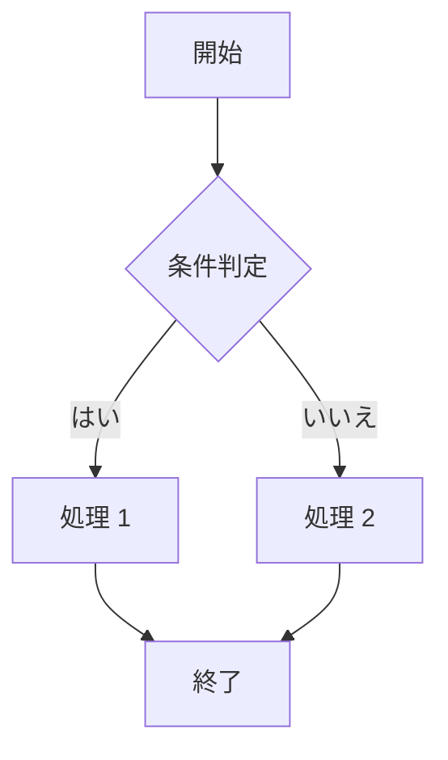
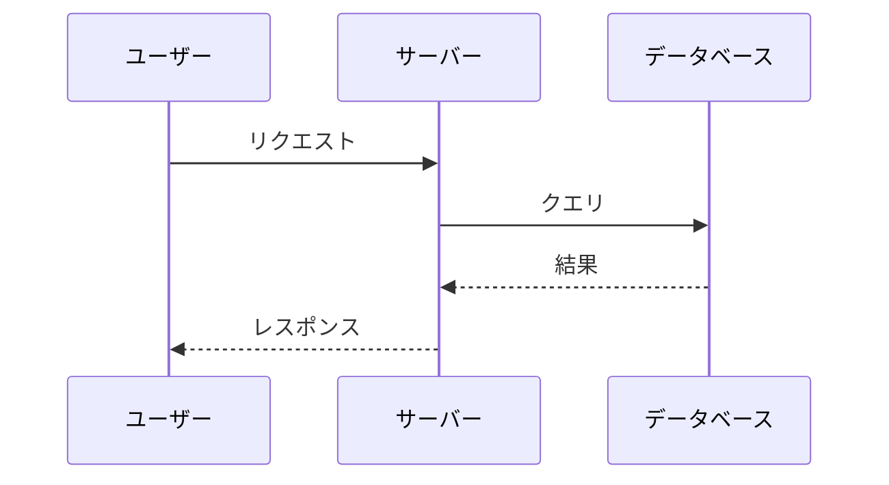
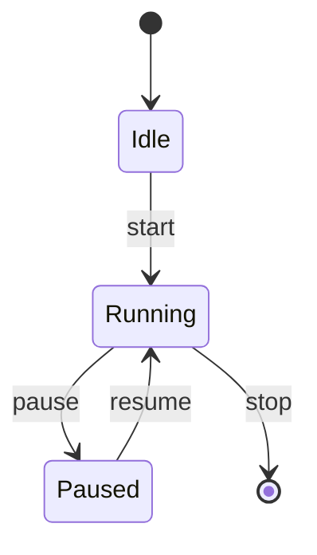

# Mermaid 図のテスト

## フローチャート

```mermaid
flowchart TD
    A[開始] --> B{条件判定}
    B -->|はい| C[処理 1]
    B -->|いいえ| D[処理 2]
    C --> E[終了]
    D --> E
```

## シーケンス図

```mermaid
sequenceDiagram
    participant U as ユーザー
    participant S as サーバー
    participant D as データベース
    U->>S: リクエスト
    S->>D: クエリ
    D-->>S: 結果
    S-->>U: レスポンス
```

## 状態遷移図

```mermaid
stateDiagram-v2
    [*] --> Idle
    Idle --> Running: start
    Running --> Paused: pause
    Paused --> Running: resume
    Running --> [*]: stop
```

図の前後にも通常の本文が残ること。
